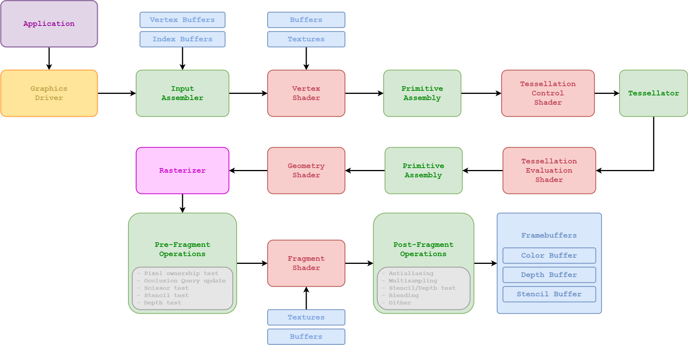

# raylib Introduction Course

*by Ramon Santamaria ([@raysan5](https://twitter.com/raysan5))*


## Introduction

In this introductory course to [raylib](http://www.raylib.com/) we will implement a Blocks game similar to the well-known [Arkanoid](https://en.wikipedia.org/wiki/Arkanoid) (Taito, 1986). Along this process we will learn how the videogames life cycle works, how to manage the window and player inputs, and how to draw some graphics on screen.

[raylib](http://www.raylib.com/) is a simple and easy-to-use library to enjoy videogames programming.

**Learning Outcomes:**

 - raylib functionality and possibilities
 - Videogame life cycle (Init -> Update -> Draw -> DeInit)
 - Basic screens management with screens transition
 - Basic shapes drawing (circle, rectangle)
 - Inputs management (keyboard, mouse)
 - Collision detection and resolution
 - Textures loading and drawing
 - Fonts loading and text drawing
 - Sounds and music loading and playing
 
**NOTE:** All code provided is in C language for simplicity and clearness but it's up to the student to use more complex C++ code structures (OOP) if desired.

## Lessons Summary

Lesson | Learning outcome | Source file | Related functions
:-----:|------------------|:------------|:-----------------:
[01](#lesson-01-introduction-to-raylib-and-videogames-programming) | raylib functionality, <br>videogame life cycle, <br>basic screens management | [01_blocks_game_intro.c](lessons/01_blocks_game_intro.c) | InitWindow(), CloseWindow(), <br>BeginDrawing(), EndDrawing()
[02](#lesson-02-draw-basic-shapes-circle-rectangle) | basic shapes drawing | [02_blocks_game_drawing.c](lessons/02_blocks_game_drawing.c) | DrawRectangle(), DrawCircle()
[03](#lesson-03-inputs-management-keyboard-mouse) | inputs management | [03_blocks_game_inputs.c](lessons/03_blocks_game_inputs.c) | IsKeyPressed(), IsKeyDown(), <br>IsMouseButtonPressed(), <br>IsMouseButtonDown(), <br>GetMouseX(), GetMouseY()
[04](#lesson-04-collision-detection-and-resolution) | collision detection and resolution | [04_blocks_game_collisions.c](lessons/04_blocks_game_collisions.c) | CheckCollisionCircleRec(), <br>CheckCollisionRecs(), <br>CheckCollisionCircles()
[05](#lesson-05-textures-loading-and-drawing) | textures loading and drawing | [05_blocks_game_textures.c](lessons/05_blocks_game_textures.c) | LoadTexture(), UnloadTexture(), <br>DrawTexture()
[06](#lesson-06-fonts-loading-and-text-drawing) | fonts loading and text drawing | [06_blocks_game_text.c](lessons/06_blocks_game_text.c) | LoadFont(), UnloadFont(), <br>DrawText(), DrawTextEx()
[07](#lesson-07-sounds-and-music-loading-and-playing) | sounds and music loading and playing | [07_blocks_game_audio.c](lessons/07_blocks_game_audio.c) | InitAudioDevice(), CloseAudioDevice(), <br>LoadSound(), UnloadSound(), <br>PlaySound(), LoadMusicStream(), UnloadMusicStream(), <br>PlayMusicStream()

**NOTE:** Most of the documentation for the exercise is directly included in the source code files as code comments. Read carefully those comments to understand every task and how implement the proposed solutions.

### Lesson 01: Introduction to raylib and videogames programming

*Lesson code file to review: [01_blocks_game_intro.c](lessons/01_blocks_game_intro.c)*

In this first lesson we will introduce raylib library and videogames programming principles. We will setup raylib and take a look to its functionality; we will see how videogame life cycle works and we will implement a basic screens management system for our game.

**Introduction to raylib**

raylib is simple and easy-to-use library to learn videogames programming. raylib abstracts the user from the more low level libraries like OpenGL or GLFW3.

Here there are some interesting links to know more about raylib:

 - [raylib Features](http://www.raylib.com)
 - [raylib Frequently Asked Questions](https://github.com/raysan5/raylib/blob/master/FAQ.md)
 - [raylib Architecture](https://github.com/raysan5/raylib/wiki/raylib-architecture)
 - [raylib Functions Cheatsheet](http://www.raylib.com/cheatsheet/cheatsheet.html)
 - [raylib Data Structures](https://github.com/raysan5/raylib/wiki/raylib-data-structures)
 - [raylib Examples](http://www.raylib.com/examples.html)
 - [raylib Wiki](https://github.com/raysan5/raylib/wiki)

raylib follows the KISS principle, providing simple functions with clear naming conventions. Main documentation for the library functionality is condensed in a single [cheatsheet](http://www.raylib.com/cheatsheet/cheatsheet.html).

**Environment setup**

raylib can be used with many environment configurations as far as a code-editor and compiler are provided.  
By default, [raylib webpage](http://www.raylib.com/) distributes a Windows Installer containing all required tools to develop videogames with raylib in C/C++ on Windows platforms. Tools included with installer are **preconfigured** versions of:

 - [w64devkit/MinGW](https://github.com/skeeto/w64devkit) - Minimalistic GNU for Windows, including GCC compiler and several tools and libraries
 - [Notepad++](https://notepad-plus-plus.org) - Windows simple code editor, preconfigured with multiple compiling scripts
 
In case some students desire to use other tools or want to work in another environment different than Windows, detailed information is provided on [raylib Wiki](https://github.com/raysan5/raylib/wiki) to configure raylib on multiple environments, including [macOS](https://github.com/raysan5/raylib/wiki/Working-on-macOS) and [GNU Linux](https://github.com/raysan5/raylib/wiki/Working-on-GNU-Linux) platforms.

**Basic concept: Game loop**

The standard videogame game loop or life-cycle consist of 4 parts: **Initialization -> [ Update -> Draw ] -> DeInitialization**

The following diagram shows this life-cycle, the related processes for every part of the cycle and some of the raylib functions involved in those processes:


**Basic concept: Graphic Pipeline**

Understanding the Graphics Pipeline is very important to understand the processes that happen in a computer to generate one-frame of the game. Despite it could be a quite advanced topic to go into detail, here it is a general diagram of the process:



**Basic concept: Screens management**

To manage the different screens for our game we have multiple options, we will start with the most simple one, based in game states tracked by a simple enum.

On our game loop (Update/Draw) we will just check for current game state and we will Update/Draw required data.

Recommended [raylib examples](http://www.raylib.com/examples.html) to check:
 - [core_basic_window](http://www.raylib.com/examples/web/core/loader.html?name=core_basic_window) - simple code showing a videogame life cycle
 - [core_basic_screen_manager](https://github.com/raysan5/raylib/blob/master/examples/core/core_basic_screen_manager.c) - basic screens management structure
 

### Lesson 02: Draw basic shapes (circle, rectangle)

*Lesson code file to review: [02_blocks_game_drawing.c](lessons/02_blocks_game_drawing.c)*

To draw basic shapes, raylib provides the following functions:
```c
void DrawPixel(int posX, int posY, Color color);
void DrawLine(int startPosX, int startPosY, int endPosX, int endPosY, Color color);
void DrawCircle(int centerX, int centerY, float radius, Color color);
void DrawCircleLines(int centerX, int centerY, float radius, Color color);
void DrawRectangle(int posX, int posY, int width, int height, Color color);
void DrawRectangleLines(int posX, int posY, int width, int height, Color color);
```
Most of those functions are self explanatory, they must be called in the draw part of the game loop, between `BeginDrawing()` and `EndDrawing()`. User needs to provide the drawing position (x, y), size and color. Just note that in case of rectangle-shapes drawing origin is upper-left corner while drawing circle-shapes origin is set in the center of the circle.

Recommended [raylib examples](http://www.raylib.com/examples.html) to check:
 - [shapes_basic_shapes](http://www.raylib.com/examples/web/shapes/loader.html?name=shapes_basic_shapes) - basic shapes drawing
 - [shapes_logo_raylib](http://www.raylib.com/examples/web/shapes/loader.html?name=shapes_logo_raylib) - raylib logo drawn using shapes


### Lesson 03: Inputs management (keyboard, mouse)

*Lesson code file to review: [03_blocks_game_inputs.c](lessons/03_blocks_game_inputs.c)*

To manage inputs, raylib provides a set of functions to detect keyboard and mouse current state:
```c
bool IsKeyPressed(int key);               // Detect if a key has been pressed once
bool IsKeyDown(int key);                  // Detect if a key is being pressed
bool IsKeyReleased(int key);              // Detect if a key has been released once
bool IsKeyUp(int key);                    // Detect if a key is NOT being pressed
    
bool IsMouseButtonPressed(int button);    // Detect if a mouse button has been pressed once
bool IsMouseButtonDown(int button);       // Detect if a mouse button is being pressed
bool IsMouseButtonReleased(int button);   // Detect if a mouse button has been released once
bool IsMouseButtonUp(int button);         // Detect if a mouse button is NOT being pressed
int GetMouseX(void);                      // Returns mouse position X
int GetMouseY(void);                      // Returns mouse position Y
Vector2 GetMousePosition(void);           // Returns mouse position XY
```
This set of functions can be used in the `update` part of the game loop to check **if** one key or button has been pressed (or is being pressed in that frame).  

Recommended [raylib examples](http://www.raylib.com/examples.html) to check:
 - [core_input_keys](http://www.raylib.com/examples/web/core/loader.html?name=core_input_keys) - keyboard inputs check
 - [core_input_mouse](http://www.raylib.com/examples/web/core/loader.html?name=core_input_mouse) - mouse inputs check


### Lesson 04: Collision detection and resolution

*Lesson code file to review: [04_blocks_game_collisions.c](lessons/04_blocks_game_collisions.c)*

To check collisions between simple shapes (circle, rectangle), raylib provides the following functions:
```c
bool CheckCollisionRecs(Rectangle rec1, Rectangle rec2);                                    // Check collision between two rectangles
bool CheckCollisionCircles(Vector2 center1, float radius1, Vector2 center2, float radius2); // Check collision between two circles
bool CheckCollisionCircleRec(Vector2 center, float radius, Rectangle rec);                  // Check collision between circle and rectangle
```
Those functions return *true* if the involved rectangles/circles collide, is up to the user to resolve that collision in an appropiate way. Keep always in mind that collisions in games are always treatened as two separate parts: **detection** and **resolution**.


### Lesson 05: Textures loading and drawing

*Lesson code file to review: [05_blocks_game_textures.c](lessons/05_blocks_game_textures.c)*

Actually texture loading and drawing is a quite complex process: 

First, the image file is loaded, image data is usually decompressed and decodified (.png, .jpg) to obtain a plain array of pixel data; every pixel can be interpreted with different pixel formats (8bit, 16bit, 32bit...) but usually raylib translates that data to RGBA 32Bit (4 channels - RedGrenBlueAlpha, 8bit per channel). Image data is loaded into RAM.

Second, that image data must be uploaded to VRAM memory (GPU) to be used on screen rendering. 

Third, when drawing a texture to screen, texture is actually pasted over a quad (two triangles structure) and processed to display on the screen; that processing occurs in a per-fragment basis... think about it like a per pixel or sub-pixel processing, placing every fragment on the final canvas.

raylib provides multiple functions to deal with textures an images, depending on the intended use of the data, user can choose the right one; for example, most of the time, images will be loaded as textures to be displayed on screen but image data can also be used to generate 3d models, like in the case of [heightmaps](https://www.raylib.com/examples/web/models/loader.html?name=models_heightmap).

To load and draw textures, raylib provides the following functions:
```c
Texture2D LoadTexture(const char *fileName);       // Load an image file as texture into GPU memory
void UnloadTexture(Texture2D texture);             // Unload texture from GPU memory

void DrawTexture(Texture2D texture, int posX, int posY, Color tint); // Draw a texture in the canvas
```

Recommended [raylib examples](http://www.raylib.com/examples.html) to check:
 - [textures_logo_raylib](http://www.raylib.com/examples/web/textures/loader.html?name=textures_logo_raylib) - texture loading and drawing
 - [textures_rectangle](http://www.raylib.com/examples/web/textures/loader.html?name=textures_rectangle) - texture loading and piece drawing


### Lesson 06: Fonts loading and text drawing

*Lesson code file to review: [06_blocks_game_text.c](lessons/06_blocks_game_text.c)*

To draw text, raylib loads a default font on `InitWindow()`, that font is used when drawing text with:
```c
void DrawText(const char *text, int posX, int posY, int fontSize, Color color);
```
But raylib users can also load custom fonts, raylib support multiple fonts formats, including TTF format and BMFonts. To load custom fonts and draw with them, use the following functions:
```c
Font LoadFont(const char *fileName);         // Load a Font image into GPU 
void UnloadFont(Font font);                  // Unload Font from GPU memory

void DrawTextEx(Font font, const char* text, Vector2 position, int fontSize, int spacing, Color tint);
```

Recommended [raylib examples](http://www.raylib.com/examples.html) to check:
 - [text_sprite_fonts](http://www.raylib.com/examples/web/text/loader.html?name=text_sprite_fonts) - sprite fonts loading and drawing
 - [text_bmfonts_ttf](http://www.raylib.com/examples/web/text/loader.html?name=text_bmfont_ttf) - bmfonts and ttf fonts loading
 - [text_writing_anim](http://www.raylib.com/examples/web/text/loader.html?name=text_writing_anim) - text writting animation effect


### Lesson 07: Sounds and music loading and playing

*Lesson code file to review: [07_blocks_game_audio.c](lessons/07_blocks_game_audio.c)*

To deal with audio on raylib, first of all, audio device must be initialized. To manage audio device, use the following functions:
```c
void InitAudioDevice(void);                 // Initialize audio device and context
void CloseAudioDevice(void);                // Close the audio device and context (and music stream)
```
To load and play sounds, raylib provides the following functions:
```c
Sound LoadSound(const char *fileName);      // Load sound from file into memory
void UnloadSound(Sound sound);              // Unload sound from memory

void PlaySound(Sound sound);                // Play a sound
void PauseSound(Sound sound);               // Pause a sound
void ResumeSound(Sound sound);              // Resume a paused sound
void StopSound(Sound sound);                // Stop playing a sound
```
To load and stream music, raylib provides the following functions:
```c
Music LoadMusicStream(const char *fileName);    // Load music stream from file
void UnloadMusicStream(Music music);            // Unload music stream

void UpdateMusicStream(Music music);            // Update buffers for music streaming
void PlayMusicStream(Music music);              // Start music playing
void PauseMusicStream(Music music);             // Pause music playing
void ResumeMusicStream(Music music);            // Resume playing paused music
void StopMusicStream(Music music);              // Stop music playing
```

Recommended [raylib examples](http://www.raylib.com/examples.html) to check:
 - [audio_sound_loading](http://www.raylib.com/examples/web/audio/loader.html?name=audio_sound_loading) - sounds loading and playing
 - [audio_music_stream](http://www.raylib.com/examples/web/audio/loader.html?name=audio_music_stream) - music loading and streaming


## Getting help 
It's recommended to join [raylib Discord community](https://discord.gg/raylib) to ask other developers and get help from the community or just showcase your creations.

## License

This lecture is licensed under a <a rel="license" href="http://creativecommons.org/licenses/by-nc/4.0/">Creative Commons Attribution-NonCommercial 4.0 International License</a>.

Lessons code is licensed under an unmodified zlib/libpng license.

Check [LICENSE](LICENSE) for further details.

*Copyright (c) 2017-2022 Ramon Santamaria ([@raysan5](https://twitter.com/raysan5))*
